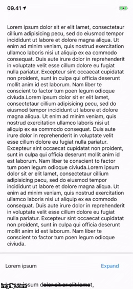
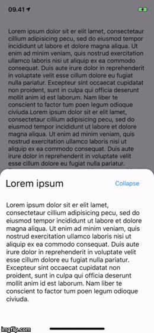

[](https://github.com/Carthage/Carthage)

[](https://github.com/nodes-ios/Reachability-UI/blob/master/LICENSE)
[](https://circleci.com/gh/nodes-ios/Drawer)

## Intro

`Drawer` is a framework that enables you to easily embed a `UIViewController` in a drawer and display it on top of another `UIViewController`.




## 📝 Requirements

- iOS 11
- Swift 4.0+

## 📦 Installation

### Carthage
~~~bash
github "nodes-ios/Drawer"
~~~

## 💻 Usage

### Requirements

* A `UIViewController` for the drawer to be displayed over. This `ViewController` is referred to as the `backgroundViewController` in the following steps
* A `UIViewController` to act as the content of the drawer. This `ViewController` is referred to as the `contentViewController` in the following steps.

### Steps

#### Creating a Drawer
Start by conforming your `contentViewController` to the `Embeddable` protocol. This exposes several delegate functions to the `contentViewController`.

```swift
extension ContentViewController: Embeddable {}
```

Furthermore an instance of `EmbeddableContentDelegate` is exposed. This `delegate` can be used to instruct the drawer to perform various tasks by calling the `handle` function on it.

The `handle` function takes an `enum` of type `Drawer.EmbeddedAction` which allows these actions:

- `layoutUpdated(config: Drawer.ContentConfiguration)` to update the layout of your drawer
- `changeState(to: MovementState)` to show/hide your drawer.

After creating the `contentViewController`, initialize an instance of `DrawerCoordinator` in your `backgroundViewController` to initialize the drawer.

```swift
let drawer = DrawerCoordinator(contentViewController: contentVC,
backgroundViewController: self,
drawerBackgroundType: .withColor(UIColor.black.withAlphaComponent(0.5)))
```

#### Displaying a Drawer
After your content's views have finished creating and you are ready to display the drawer, create an instance of `Drawer.ContentConfiguration` to set the drawer state and properties.

```swift
let contentConfiguration = Drawer.ContentConfiguration(duration: animationDuration,
                                                        embeddedFullHeight: maxHeight,
                                                        state: .minimised,
                                                        embeddedMinimumHeight: minHeight,
                                                        cornerRadius: Drawer.ContentConfiguration.CornerRadius(fullSize: 20,
                                                                                                                minimised: 0),
                                                        dismissCompleteCallback:
{ [weak self] in
    guard let self = self else { return }
    //TODO: Drawer dismissed.
})

```

Communication with the `EmbeddableContentDelegate` is managed by calling the `handle` function, which takes an `enum` of type `Drawer.EmbeddedAction` as a parameter.
Finally call the `EmbeddableContentDelegate` `handle` function to update the drawer's layout to the new `ContentConfiguration`

 ```swift
 embedDelegate?.handle(embeddedAction: .layoutUpdated(config: contentConfiguration))
 ```

 #### Expanding and Collapsing a Drawer
 To expand and collapse the drawer programatically, call the `EmbeddableContentDelegate` `handle` function with a `changeState` action containing the state which the drawer should transition to.

 ```swift
embedDelegate?.handle(embeddedAction: .changeState(to: .fullScreen))
 ```

## Example Project
To learn more, please refer to the example project contained in this repository.

## 👥 Credits
Made with ❤️ at [Nodes](http://nodesagency.com).

## 📄 License
**Drawer** is available under the MIT license. See the [LICENSE](https://github.com/nodes-ios/DrawerI/blob/master/LICENSE) file for more info.
